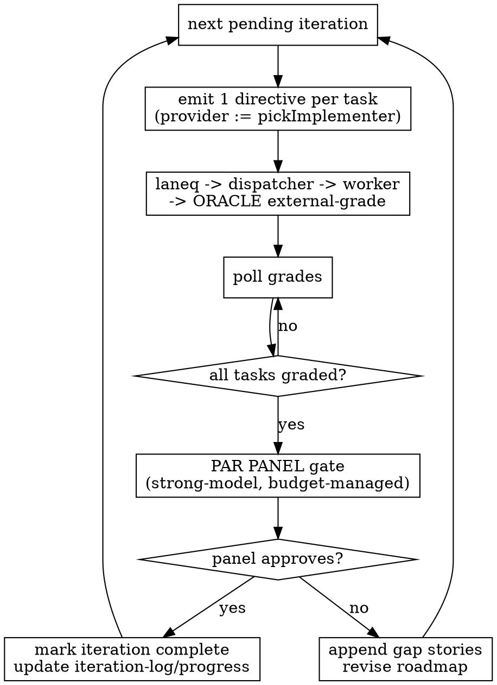

# Fleet-Native Iterative Development

## Overview

A fleet-dispatching variant of `iterative-development:iterative-development`. The orchestrator runs as a **thin local Claude coordinator**: it reuses the same iteration artifacts, but turns each iteration's tasks into **fleet directives** (laneq queue → dispatcher → ephemeral worker → oracle external-grade) instead of running in-session Claude subagents. **PAR is preserved as the gate that completes an iteration.** Fleet implementation spends **zero Claude Max implementer tokens** — that quota stays for interactive work.

Design record: `docs/superpowers/specs/2026-06-28-iterative-development-fleet-design.md`.

**Core principle:** offload the grind, keep the gate. The fleet implements and oracle-grades; a parallel adversarial review panel still decides whether an iteration is *actually* complete.

## When to Use

- A roadmap already exists (run `iterative-development:extracting-requirements` and `scoping-the-simplest-core` first — those phases are unchanged and stay in-session).
- You want a long autonomous run that does **not** drain the Claude Max quota on implementation.
- The fleet is available (agent-host up, llm-proxy active, golden worker built).

**Do NOT use when:** there is no fleet available (use the in-session `iterative-development` instead); the project is small/bounded (use `subagent-driven-development`); or you need PAR run by the strongest possible reviewer regardless of quota (use the in-session skill).

## Reused Artifacts

Same files and schema as `iterative-development` — this is a different *engine* over the same state, so a run is inspectable/resumable with existing tooling:
`requirements/`, `roadmap.md`, `behavior-scenarios.md`, `behavior-corpus.md`, `iteration-log.md`, `progress.md`.

## The Loop

Per task, a directive is `{repo, ref, task, hidden-oracle}` dispatched via the existing dispatcher
external-grading path (STORY-0068). `pass → mark story done`; `fail → requeue with bounded retries → escalate to the durable escalation lane` for a later session.

## Two-Level Quality (both gates required)

- **Per-task: oracle.** The held-out oracle external-grade on a clean checkout is the authoritative verdict that a single task passed. Deterministic, no model.
- **Per-iteration: PAR panel.** An iteration is complete **only** when a parallel adversarial review panel approves its behavior evidence — independent reviewers hunting coverage gaps, weak evidence, and boxing-in across the iteration's corpus (the three-tier audit / scope-review power of iterative-development). **Green oracle grades alone do NOT complete an iteration.**

## Quota-Aware Executor Routing

`pickImplementer(taskDifficulty, budgetSnapshot) → provider`, reading the usage meter
(`dispatcher usage`) for per-provider budget state:

- **ollama-local is the unlimited floor.** No token quota; runs indefinitely. It is the **default** implementer and the reason the loop never fully stalls.
- **Quota-bearing strong providers** (codex/openai, ollama-cloud, and Claude **only within the reserve cap**) are metered + reserve-capped per provider — each its own managed budget. Used for the **PAR panel** (provider-diverse strengthens adversarial review) and for hard tasks the local floor can't carry. A provider over its reserve cap is **skipped**.

Never route fleet implementation to Claude Max — that quota is reserved for interactive work.

## Resilience

- **Implementation never stalls:** it falls back to the ollama-local floor when paid quotas are spent.
- **PAR integrity over speed:** the panel requires strong models, so if that budget is exhausted, iteration *completion* **parks until the window resets** — it does NOT complete on a degraded review — while implementation keeps progressing on the floor.
- **Crash-safe / resumable:** all state lives in the artifacts + laneq queue + escalation lane. Re-invoking the skill resumes from the artifacts (same guarantee as the in-session skill).

## Common Mistakes

- **Completing an iteration on green grades alone.** Oracle grades are per-task; the PAR panel is the iteration gate. Skipping it discards the method's main source of power.
- **Routing implementation to claude-code.** Defeats the quota-isolation purpose. Implementation defaults to ollama-local; strong quota-bearing providers are for PAR and hard tasks only.
- **Letting PAR run on the unlimited floor when strong budget is gone.** That yields a degraded gate. Park completion instead.
- **Re-running extract/scope here.** Those phases are unchanged — run them with the in-session `iterative-development` skill; this skill starts from an existing `roadmap.md`.

## Out of Scope (v1)

Cluster-resident orchestrator (umbrella Approach B); the non-iterative-development producer; tiered escalation beyond a single PAR panel. See the design doc.
